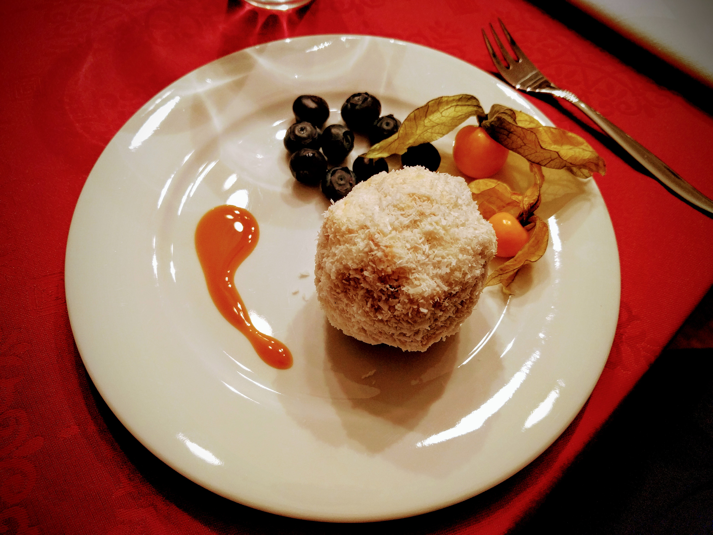

# Schneebälle

Süßes, zartes Biskuitgebäck.
Traditionelles Weihnachtsdessert in meiner Familie.

*Enthält Eier, Milchprodukte, Alkohol. Glutenfreie Variante mit entsprechendem Mehl einfach zu bewerkstelligen.*

## Zutaten

* 5 EL (60 ml) kaltes Wasser
* 1 Prise Salz
* 7 Eier
* 150 g Kokosflocken
* 2 Päckchen Sahnesteif
* 400 g Sahne
* 125 ml Amaretto
* 150 g Crème fraîche
* 250 g Magerquark
* ½ TL (2 g) Backpulver
* 200 g Mehl
* 200 g Zucker für die Biskuit-Basis
* 50 g Zucker für die Schneebälle
* 2 Päckchen Vanillezucker
* 18 (Papier-)Förmchen

## Zubereitung

### Biskuit

* Eier trennen.
* Eiweiß, Salz und Wasser steif schlagen. **Währenddessen** ein Päckchen Vanillezucker und 200 g Zucker einrieseln lassen.
* Eigelb einzeln darunter schlagen.
* Mehl und Backpulver mischen und unterheben.
* Auf ein Backblech streichen und im vorgeheizten Backofen bei 175 °C 25–30 Minuten backen.
* Auskühlen lassen.

### Bälle

* Quark, Crème fraîche, Amaretto, 50 g Zucker und ein Päckchen Vanillezucker glatt verrühren.
* Sahne steif schlagen, dabei Sahnesteif einrieseln lassen. Unter die Amaretto-Quark-Masse ziehen.
* Biskuit in feine Stücke zupfen und zur Amaretto-Quark-Masse geben.
* Alles gut zu einem Teig vermischen.
* Aus der Masse 18 gleichmäßige Bälle formen. In den Kokosflocken wenden und in Förmchen setzen.
* Kühl servieren.
